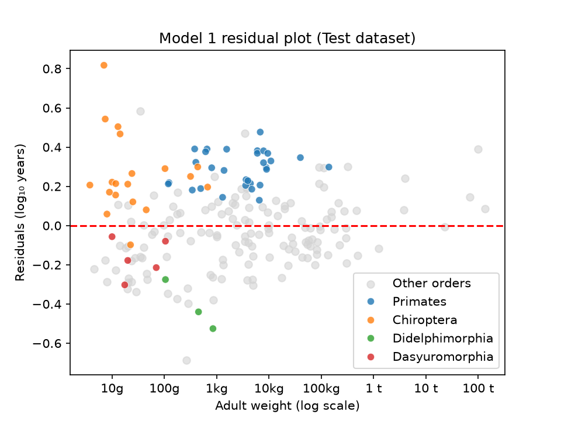
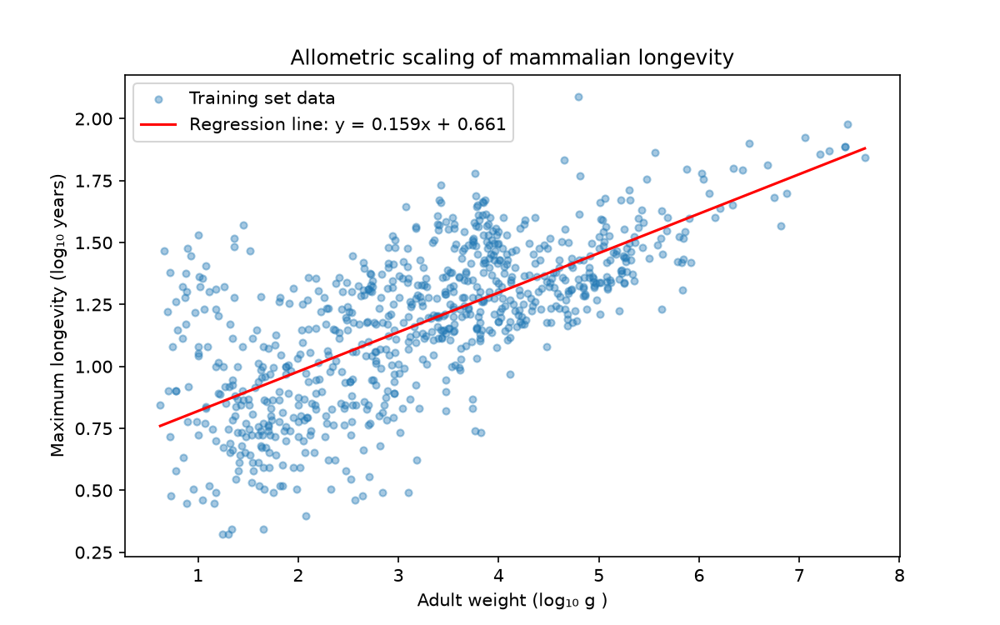
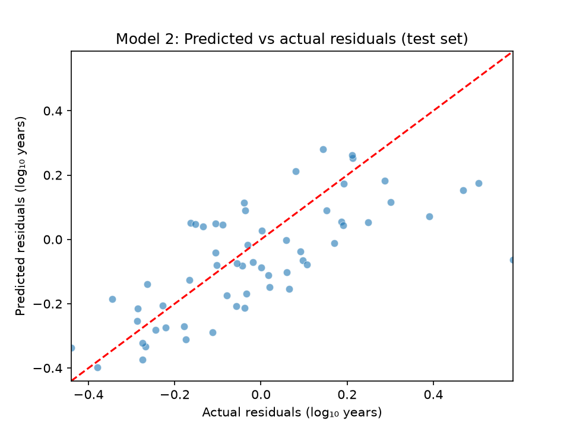
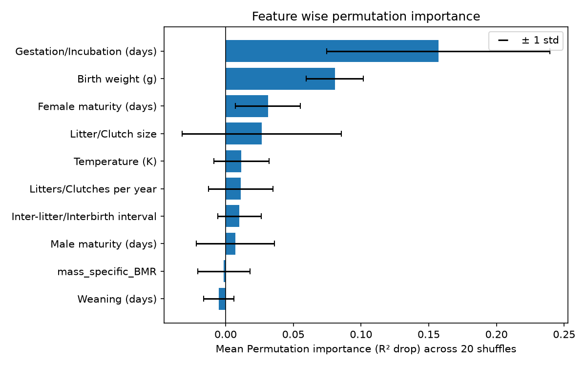
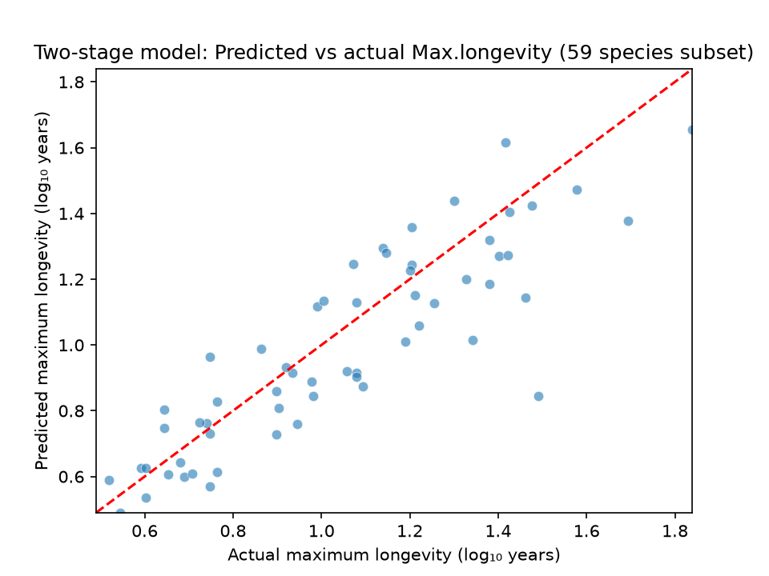

# Mammalian Longevity - Allometric scaling and Residual analysis.
*Using allometric scaling to predict maximum longevity of a set of mammalian species, followed by residual analysis, in order to ascertain biological traits associated with unexpected lifespans.*




*Points lying above the dashed line represent species living longer than their size predicts; those below live shorter. Four key orders are highlighted for illustrative purposes.*


---

## Table of Contents

[1. Project Overview](#1-project-overview)

[2. Data](#2-data)

[3. Repository Structure](#3-repository-structure)

[4. Workflow](#4-workflow)

[5. Analysis and Metrics](#5-analysis-and-metrics-)

[6. Key Findings](#6-key-findings)

[7. Limitations & Future Enhancements](#7-limitations-and-future-enhancements)

[8. Requirements](#8-requirements)


---

## 1. Project Overview

The allometric  equation, Y = aMᵇ is often used to describe the relationship between maximum longevity of mammals and their size. But, certain mammals are found to defy these norms and live unexpectedly longer or shorter lives than what their size predicts.

This project used the HAGR AnAge Dataset, to first build a Huber Regressor that predicts maximum longevity of mammals from their adult weight. The calculated residuals from a subset of this dataset, were then used as the target variable for a Random Forest Regressor, in order to analyse the predictive power of 10 biological features. Finally, predictions from model 2 for its 59 species test set, were combined with the corresponding predictions from model 1, in order to evaluate the performance of a combined Two-stage model in predicting maximum longevity. The results of the analysis suggest that features related to parental investment, specifically birth weight and gestation length, are relevant to predicting maximum longevity of mammals in this dataset. The Two - stage model achieved an R² score of 0.73.

 
---

## 2. Data

The dataset for this project has been obtained from The Animal Ageing and Longevity Database, maintained by HAGR. More information about this dataset can be found here: https://genomics.senescence.info/help.html#anage

* No. of Entries in Dataset = 4645
* No. of Columns = 31

---

## 3. Repository Structure

```
mammalian-longevity-residual-analysis/
├── data/
|  ├── interim/                         # interim csv files to move      
|  |   |                                      across notebooks.
|  |   ├── model2_test_predictions.csv      
|  |   ├── test_residuals.csv
|  |   └── train_residuals.csv
|  |
|  ├── processed/
|  |    ├── test.csv                     # model 1 test set
|  |    ├── test2.csv                    # model 2 test set
|  |    ├── train.csv                    # model 1 train set
|  |    └── train2.csv                   # model 2 train set
|  |
|  └── raw/
|       └── anage_data.txt
|
├── figures/
|  ├── huber_regressor.png
|  ├── model1_residual_plot.png
|  ├── model2_predictions_scatter_plt.png
|  ├── permutation_importance.png
|  └── two_stage_model_predictions_plt.png
|
|
├── models/
|  ├── grid_results.pkl                   # model 2 gridsearch
|  ├── model1_pipe.pkl                    # model 1 pipeline
|  └── model2_pipe.pkl                    # model 2 pipeline
|
|
├── notebooks/
|  ├── 01-data-preparation.ipynb
|  ├── 02-model1-allometric-scaling.ipynb
|  └── 03-model2-residual-prediction.ipynb
|  └── 04-two-stage-model.ipynb
|
├── .gitignore
├── LICENSE
└── README.md

```
---


## 4. Workflow

### Model 1:

1. **Data Cleaning:**

     Filtered dataset to non-null entries of Adult weight and Maximum longevity, under Class Mammalia. 
     Removed entries with questionable Data quality as well.

    *Final cleaned dataset contained 996 entries*

2. **Splitting and Log - Transformation:**

    Data was Train-Test split, stratified by 'Order'. Train and test data was then log-transformed to obtain the linear relationship between X and y required to build the model.


    | Feature (X) | Target (y) |
    | --- | --- |
    | Adult weight (g) | Maximum longevity (yrs) |

    

3. **Building the Pipeline :**

    Pipeline built to scale the train set and fit the Huber Regressor on it.

4. **Cross - Validation :**
   
   10 fold Cross Validation (shuffled) was performed on train set to assess performance across folds.

4. **Model Evaluation and residual calculation:**

    Evaluation metrics for test set predictions were calculated. Train and test set residuals were calculated and appended to train and test datasets, respectively.

### Model 2:

 1. **Data cleaning:**

    Dataset was filtered to non- null entries of Metabolic rate, as it is  presumed to be an important predictor of lifespan, according to the Rate of Living theory. With only 342 non-null values, imputation would mean heavy distortion of the data. Other columns with extensive nulls were removed as well.

    *Cleaned train and test datasets contained 283 and 59 entries, respectively.*

 2. **Feature Engineering:**

    Mass-specific BMR for each entry was calculated by dividing Metabolic rate by Body mass. This was done to reduce the effect of Body mass on Metabolic rate, in order to get a better evaluation of the true relation between Metabolic rate and longevity.

    | Features (X2) |
    | --- |
    | Weaning (days) |
    | mass_specific_BMR |
    | Male maturity (days) |
    | Inter-litter/Interbirth interval |
    | Litters/Clutches per year	|
    | Temperature (K) |
    | Litter/Clutch size |
    | Female maturity (days) |
    | Birth weight (g) |
    | Gestation/Incubation (days) |

    **Target :** residual
    

3. **Imputation :**

   Remaining null values were imputed in a sequential manner with a custom 'Taxonomical Imputer'. It calculated the median feature value for each genus, family and order of the dataset as well as an overall feature median.
  
   Each null value was imputed with its corresponding genus' median wherever available, falling back to family then order then overall feature median, until no nulls were left.

   This method was used in order to impute null values with the most biologically related data available in the dataset.

4. **Building a Pipeline :**

    Pipeline built to impute missing values of train set then fit the Random Forest Regressor to the data. 

5. **Grid Search CV :**

    Performed GridSearchCV using RepeatedKFold cross validation (10 folds, 3 repeats) to tune the model to the best parameters. The fold - level results were also used to check for variation in performance across folds.

6. **Model Evaluation and Feature Analysis :**

    Analysed final test set metrics and permutation importance results.

### Two - Stage Model:

- The 59 species test set of Model 2 was used for this stage.

- Using the formula, 

```
residual = true value - predicted value

```
Actual Maximum longevity values were compared to the combined predictions obtained by summing up each species' Model 1 predicted longevity value and its corresponding Model 2 predicted residual.

## 5. Analysis and Metrics :

| Metric | Description |
| --- | --- |
| R² score | Measures the proportion of variance in the target variable, explained by the model |
| Mean Absolute Error (MAE) | Measures the average magnitude of errors |
---

* Since log-transformed values have been used, MAE obtained throughout the project is in log units. For easier interpretability, an error factor has also been calculated.

```
Error factor = 10^MAE

An error factor of 1.2 would mean predictions typically lie within a factor of 1.2 of true values.

```

* Permutation importance was also analysed at the end of model 2. This measures how important a feature was for the Random Forest Regressor to make its predictions. In Model 2, a higher mean importance value for a feature indicates that a higher R² drop occurred, when that feature was shuffled.


---

## 6. Key Findings

### Model 1 :
  
- Test set R² score: 0.565
- Test set MAE: 0.183
- Error factor: 1.52

  Adult weight values account for nearly 57% of variation found in Maximum longevity of mammals in this dataset. Model 2 investigates how much of the remaining variance can be explained by a set of 10 biological traits.

* Furthermore, the regression line obtained by the model, has a similar equation to the mammalian allometric equation used by HAGR for the AnAge database.  

```
Model 1 regression line equation:

log₁₀(longevity) = 0.661 + 0.159 × log₁₀(adult weight)

HAGR mammalian allometric equation:

tmax = 4.88 * M^0.153
i.e, log₁₀(tmax) = 0.688 + 0.153*log₁₀(M)

```


*Model 1 (Huber Regressor) Regression line*


### Model 2:
 
 - Test set R² Score : 0.445
 - Test set MAE: 0.128
 - Error factor : 1.34 

   This indicates that for the subset of model 1 that was tested, model 2 was able to account for nearly 45% of the remaining variation in Maximum longevity.

    

 * Permutation importance results identified Gestation length with a mean importance score of 0.15 ± 0.08, and Birth weight with a score of 0.08 ± 0.02, to be the features with the largest mean reductions in test set R², when shuffled. Other features' mean importance values are indistinguishable from 0.

 

 * Gestation length and Birth weight are traits related to parental investment. This suggests that parental - investment related traits may be relevant to predicting maximum longevity of mammals in this dataset. Though, due to the limited scope of this subset, this finding should not be generalised.

### Two-stage Model :

 - R² score: 0.733
 - MAE: 0.128
 - Error factor : 1.34

   The Two-stage model predictions were able to account for 73% of variation in Maximum longevity values of the 59 mammalian species in the test set. This indicates reasonably strong predictive performance.
   


---


## 7. Limitations and Future Enhancements

### Limitations:

  1. Dataset is limited and does not include all mammalian species. 

  2. Model 2 was trained on a subset of the first model's dataset, instead of the full set, due to important feature columns having large amounts of missing values.

  3. Imputation using values of related taxonomic categories, reduces natural variation found amongst species.

### Future Enhancements:

  1. Instead of Mass-specific BMR, Residual BMR can be used to further remove distorting effects of Body mass on Metabolic rate, for more accurate comparison.

  2. Effects of Inter-feature correlation on permutation importance can be evaluated by dropping correlated features, feature engineering etc.

---

## 8. Requirements

- Python 3.14+
- JupyterLab

- Packages:

| Package | Use |
| --- | --- |
| pandas | Dataset viewing and manipulation |
| numpy | Numerical operations |
| scikit-learn | Models, pipeline, metrics |
| matplotlib | Plotting |
| seaborn | Plotting |
| joblib | Saving and loading pipeline, gridsearch |
